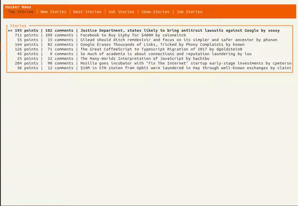

# HackerNews in the Terminal

## About

 This is terminal app written in [Rust](https://www.rust-lang.org/) using [tui-rs](https://github.com/fdehau/tui-rs/). You can 
 browse different stories and read comments from HackerNews right in your terminal. Unfortunately, since it uses HackerNews' 
 [official API](https://github.com/HackerNews/API), commenting, logging in and voting aren't available. It's also a bit 
 slow since a separate API request needs to be made for *every item*. However, we make do with 
 [reqwest's](https://github.com/seanmonstar/reqwest) async capabilities.

## Installation
No installable binaries yet. Just have to compile and run it with [cargo](https://doc.rust-lang.org/cargo/index.html) yourself.

```
git clone https://github.com/kenboo98/HackerNews-Terminal.git
cargo run
``` 

## Using it

- Use the `left` and `right` arrow keys to pick different feeds
- Use `Tab` to select between the different story feeds, the story info, and the comment section
- Press `up` and `down` to scroll
- Press `q` to quit

## To do
- Minor bugs
- Installable binaries
- Cleaner comments